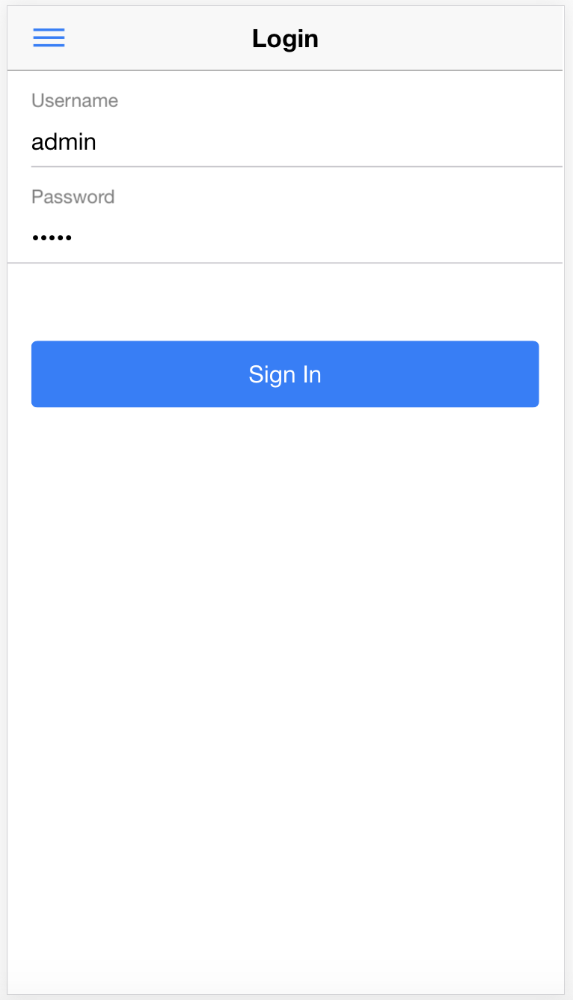
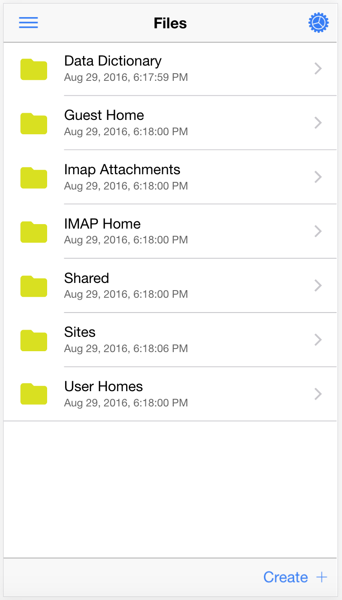
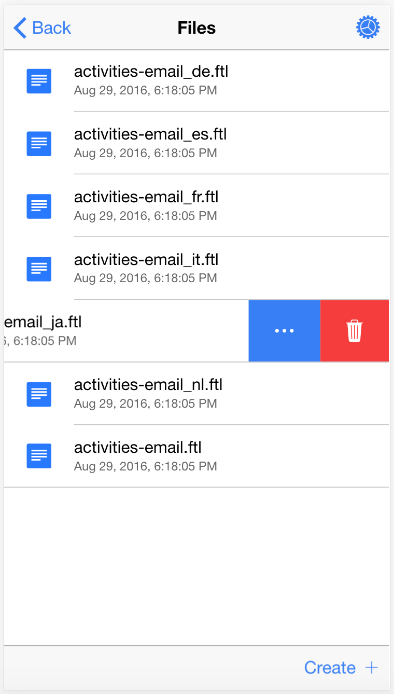
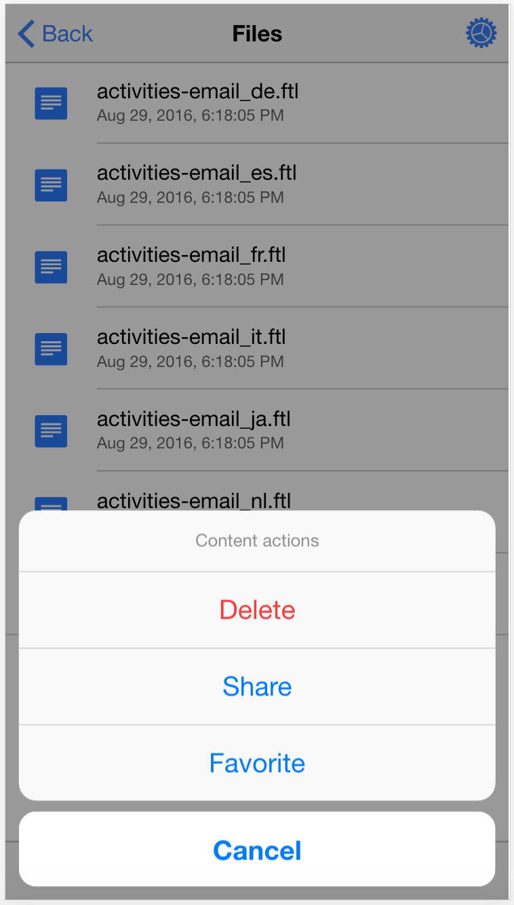
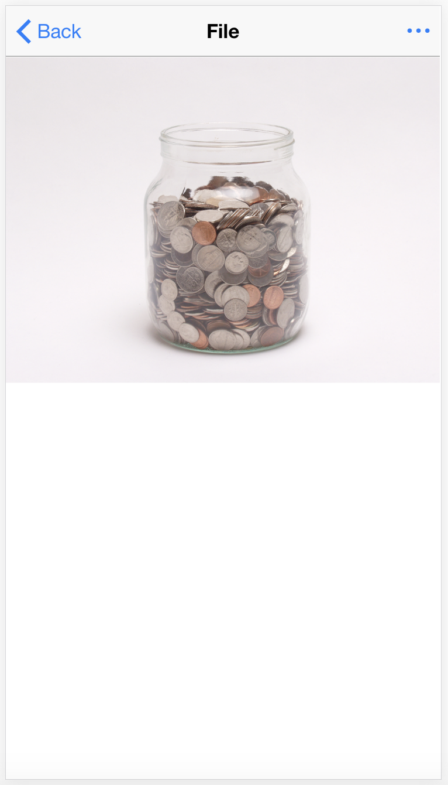
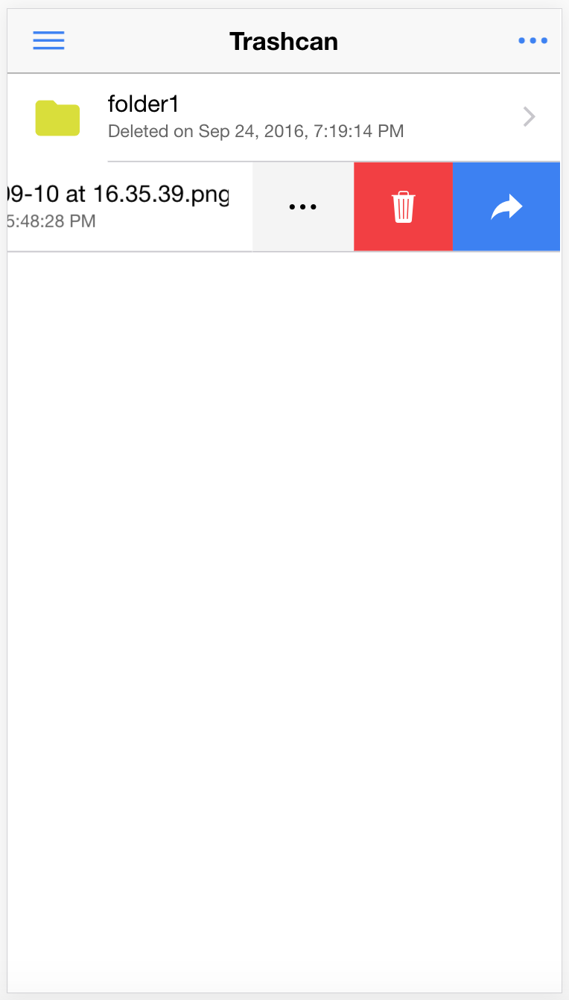
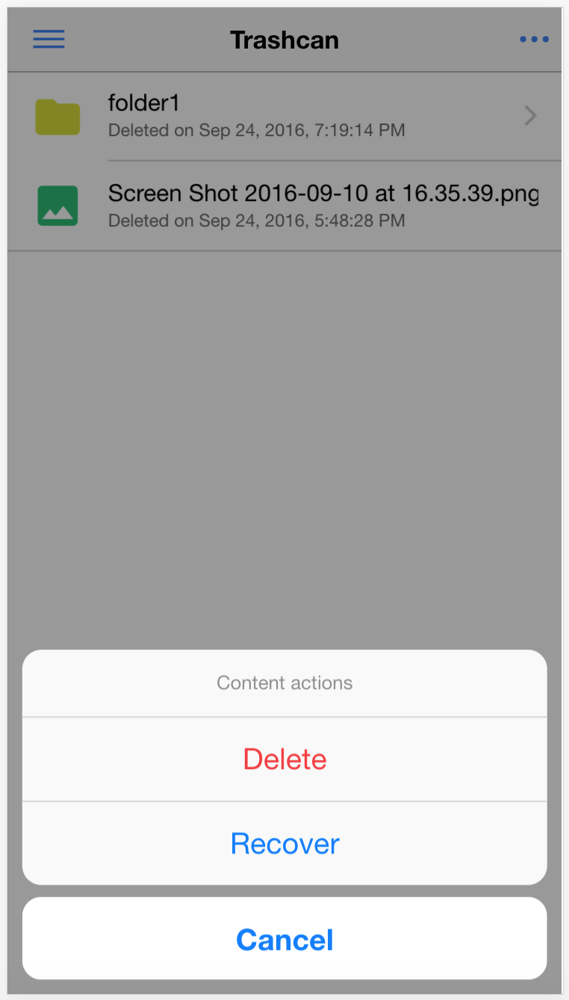

# ionic-alfresco

Alfresco ADF bindings for Ionic 2 and Angular 2

# Prerequisites

`ionic-alfresco` relies on the following:

- [alfresco-js-api](https://www.npmjs.com/package/alfresco-js-api) library v0.3.1 or later;
- [Ionic 2](http://ionicframework.com) project configured with [SystemJS](https://github.com/systemjs/systemjs) module loader;

# Installing

Use the following command to install all required dependencies:

```sh
npm install ionic-alfresco alfresco-js-api --save
```

# Demo Project

You can find demo project template showcasing all features here: [Alfresco Ionic 2 App Base](https://github.com/DenisVuyka/ionic-alfresco-app).

# Basic example

*For the sake of simplicity only important content provided in the examples below:*

**View1.html**
```html
<ion-content>
  <alf-file-view
    [nodeId]="nodeId"
    [debug]="true">
  </alf-file-view>
</ion-content>
```

**View1.ts**
```ts
import { Component } from '@angular/core';
import { NavParams } from 'ionic-angular';
import { ALFRESCO_IONIC_DIRECTIVES } from 'ionic-alfresco';

declare let __moduleName: string;

@Component({
  moduleId: __moduleName,
  templateUrl: './file-view.html',
  directives: [ALFRESCO_IONIC_DIRECTIVES]
})
export class FileView {

  nodeId: string;

  constructor(private navParams: NavParams) {
    this.nodeId = navParams.get('nodeId');
  }
}
```

# Package content

## Components

- **LoginComponent**, login component
- **FolderViewComponent**, folder viewer component (Document List)
- **FileViewComponent**, file viewer component
- **TrashcanViewComponent**, trashcan viewer component

## Services

- **ApiService**, *provides access to Alfresco JS Api instance*
- **AuthService**, *authentication service*
- **NodeService**, *ECM node management service*
- **SettingsService**, *provides access to global settings*

## Constants

- **ALFRESCO_IONIC_PROVIDERS**, *exports all `ionic-alfresco` services*
- **ALFRESCO_IONIC_DIRECTIVES**, *exports all `ionic-alfresco` components and directives*

# API

## Login

```html
<alf-login
  [username]="username"
  [password]="password"
  (success)="onLoggedIn($event)"
  (failure)="onLoginError($event)">
</alf-login>
```



## Folder View

```html
<alf-folder-view
  [folderId]="folderId"
  (nodeTapped)="nodeTapped($event)"
  (error)="onError($event)">
</alf-folder-view>
```



### Sliding menus



### Content actions



## File View

```html
<alf-file-view
  [nodeId]="nodeId"
  [debug]="true">
</alf-file-view>
```



Supported content types:

- video
  - video/mp4
- images
  - image/png
  - image/jpeg
  - image/gif
- text
  - text/plain
  - text/csv
  - text/xml
  - application/json
  - application/x-javascript

## Trashcan View

```html
<alf-trashcan-view></alf-trashcan-view>
```

Supported actions:

- purge node
- restore node (file, folder)

<div>
  
  
</div>
